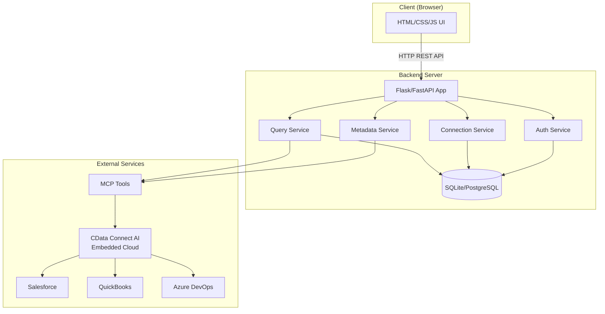
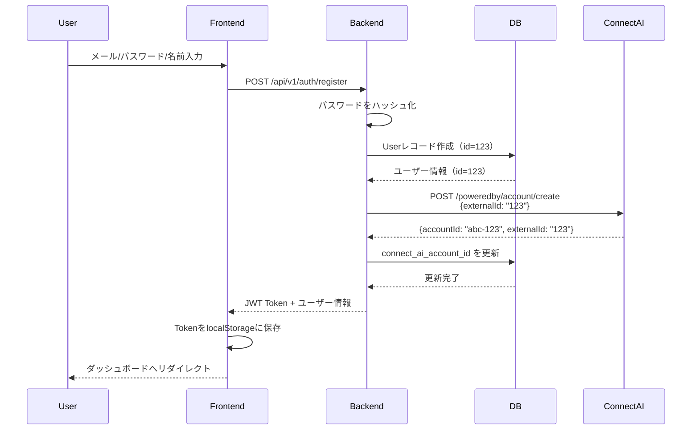
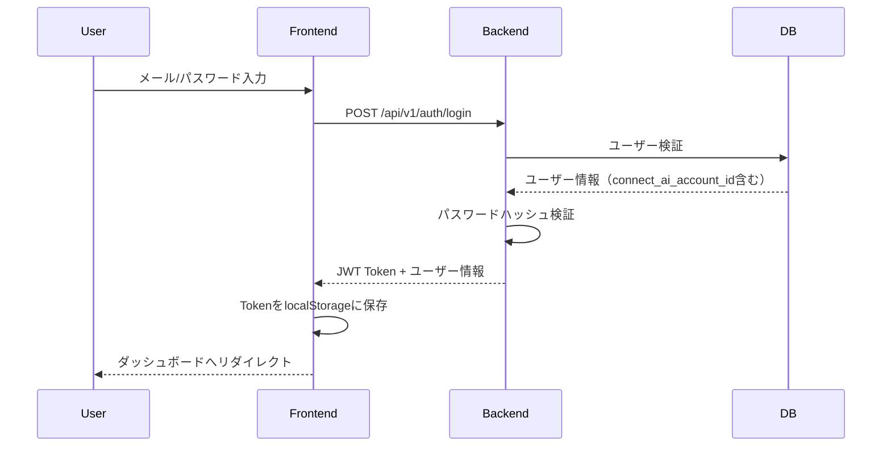
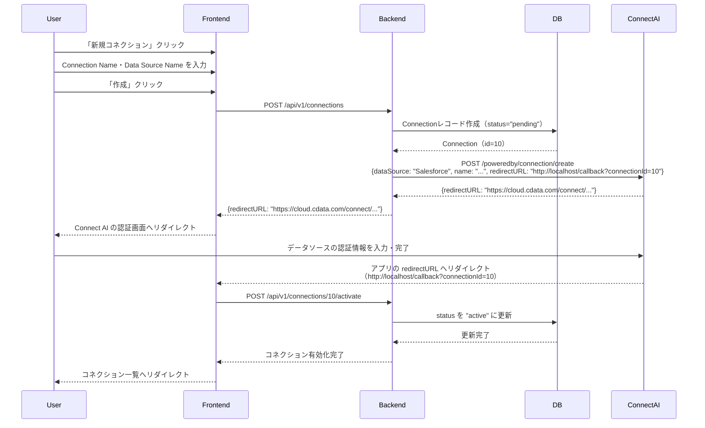
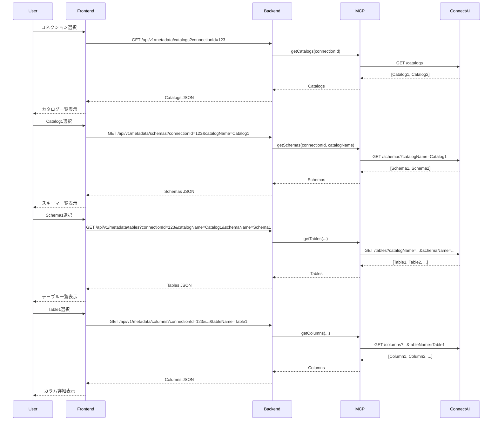
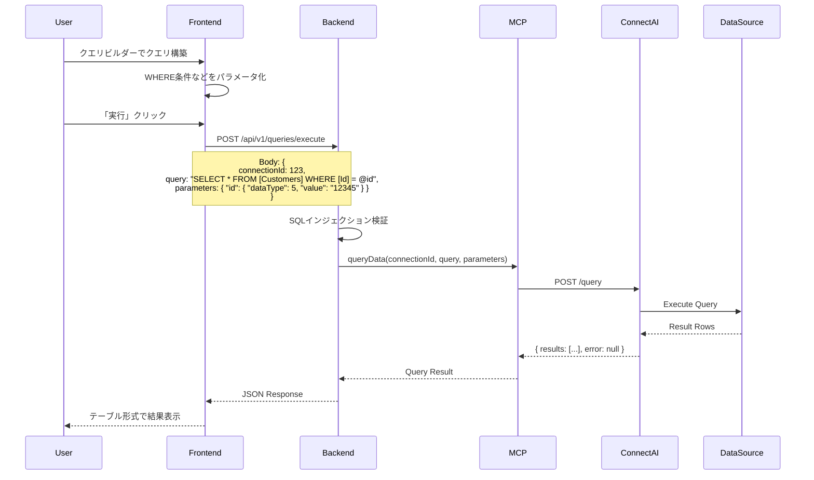
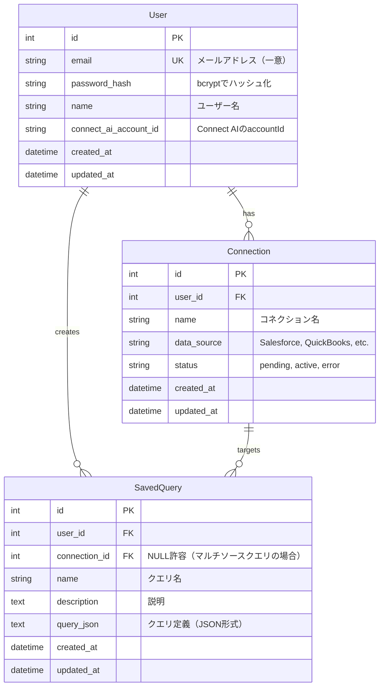
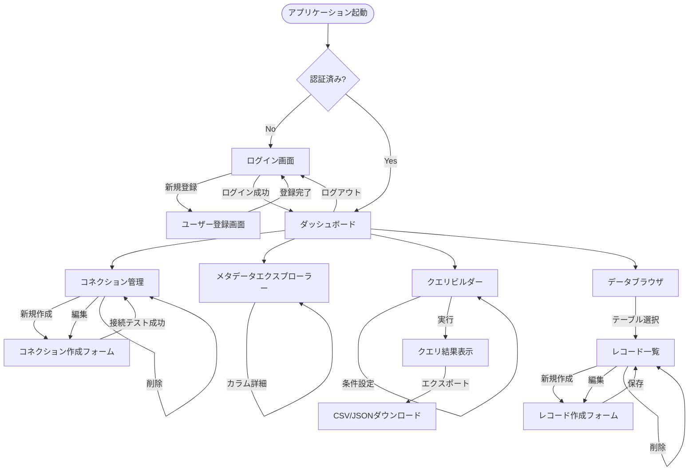

# 機能設計書: DataHub - Connect AI OEM リファレンス実装

**バージョン**: 1.0
**最終更新**: 2026-02-17
**対象フェーズ**: Phase 1-2 (MVP + クエリ・CRUD機能)

---

## 目次

1. [システムアーキテクチャ](#1-システムアーキテクチャ)
2. [システム構成図](#2-システム構成図)
3. [データモデル定義](#3-データモデル定義)
4. [コンポーネント設計](#4-コンポーネント設計)
5. [画面遷移図](#5-画面遷移図)
6. [API設計](#6-api設計)
7. [セキュリティ設計](#7-セキュリティ設計)

---

## 1. システムアーキテクチャ

### 1.1 アーキテクチャパターン

**3層アーキテクチャ + API Gateway パターン**

```
┌─────────────────────────────────────────────────────────┐
│                    Presentation Layer                    │
│  (HTML/CSS/JavaScript - ブラウザで動作するSPA風UI)      │
└─────────────────────────────────────────────────────────┘
                            ↓ HTTP/REST API
┌─────────────────────────────────────────────────────────┐
│                    Application Layer                     │
│    (Flask/FastAPI - ビジネスロジック、認証、ルーティング)│
└─────────────────────────────────────────────────────────┘
                            ↓
        ┌──────────────────┴──────────────────┐
        ↓                                     ↓
┌──────────────────┐              ┌─────────────────────┐
│   Data Layer     │              │  Integration Layer  │
│  (SQLAlchemy)    │              │  (MCP Tools)        │
│  ・User          │              │  ・getCatalogs      │
│  ・Connection    │              │  ・getSchemas       │
│  ・SavedQuery    │              │  ・getTables        │
└──────────────────┘              │  ・getColumns       │
        ↓                         │  ・queryData        │
┌──────────────────┐              │  ・executeProcedure │
│  SQLite/         │              └─────────────────────┘
│  PostgreSQL      │                        ↓
└──────────────────┘              ┌─────────────────────┐
                                  │  CData Connect AI   │
                                  │  Embedded Cloud     │
                                  └─────────────────────┘
                                           ↓
                           ┌───────────────┼───────────────┐
                           ↓               ↓               ↓
                     [Salesforce]   [QuickBooks]   [Azure DevOps]
```

### 1.2 技術スタック詳細

#### Backend
- **フレームワーク**: Flask 3.x または FastAPI 0.1x
  - 選定理由: 軽量、学習コスト低、RESTful API構築に最適
- **ORM**: SQLAlchemy 2.x
- **認証**: Flask-Login (Flask) / OAuth2PasswordBearer (FastAPI)
- **バリデーション**: Pydantic (データスキーマ検証)
- **暗号化**: cryptography (コネクション認証情報の暗号化)
- **環境変数管理**: python-dotenv

#### Frontend
- **HTML5/CSS3**: セマンティックマークアップ
- **CSSフレームワーク**: Tailwind CSS (ユーティリティファースト)
- **JavaScript**: Vanilla JS または Alpine.js (軽量リアクティブ)
- **HTTPクライアント**: Fetch API
- **アイコン**: Heroicons または Feather Icons

#### Database
- **開発環境**: SQLite 3.x
- **本番想定**: PostgreSQL 14+
- **マイグレーション**: Alembic

#### Infrastructure
- **ホスティング**: Heroku / AWS (EC2 + RDS) / Azure App Service
- **CI/CD**: GitHub Actions
- **ログ管理**: Python logging + CloudWatch/Azure Monitor

### 1.3 ディレクトリ構造

```
ConnectAIOEMSample/
├── backend/
│   ├── app.py                       # アプリケーションエントリーポイント
│   ├── config.py                    # 環境別設定
│   ├── models/
│   │   ├── __init__.py
│   │   ├── user.py                  # Userモデル
│   │   ├── connection.py            # Connectionモデル
│   │   └── saved_query.py           # SavedQueryモデル
│   ├── schemas/
│   │   ├── __init__.py
│   │   ├── user_schema.py           # Pydanticスキーマ
│   │   ├── connection_schema.py
│   │   └── query_schema.py
│   ├── services/
│   │   ├── __init__.py
│   │   ├── auth_service.py          # 認証ビジネスロジック
│   │   ├── connection_service.py    # コネクション管理ロジック
│   │   ├── metadata_service.py      # メタデータ取得ロジック
│   │   └── query_service.py         # クエリ実行ロジック
│   ├── connectai/
│   │   ├── __init__.py
│   │   ├── client.py                # MCP Tools ラッパー
│   │   └── exceptions.py            # Connect AI固有の例外
│   ├── api/
│   │   ├── __init__.py
│   │   ├── v1/
│   │   │   ├── __init__.py
│   │   │   ├── auth.py              # /api/v1/auth/*
│   │   │   ├── connections.py       # /api/v1/connections/*
│   │   │   ├── metadata.py          # /api/v1/metadata/*
│   │   │   └── queries.py           # /api/v1/queries/*
│   ├── middleware/
│   │   ├── __init__.py
│   │   ├── auth_middleware.py       # JWT検証
│   │   └── error_handler.py         # グローバルエラーハンドラー
│   ├── utils/
│   │   ├── __init__.py
│   │   ├── crypto.py                # 暗号化/復号化
│   │   ├── validators.py            # カスタムバリデーター
│   │   └── logger.py                # ロガー設定
│   ├── migrations/                  # Alembicマイグレーション
│   ├── tests/
│   │   ├── __init__.py
│   │   ├── test_auth.py
│   │   ├── test_connections.py
│   │   ├── test_metadata.py
│   │   └── test_queries.py
│   ├── requirements.txt
│   └── .env.example
├── frontend/
│   ├── index.html                   # ランディングページ
│   ├── pages/
│   │   ├── login.html               # ログイン
│   │   ├── register.html            # ユーザー登録
│   │   ├── dashboard.html           # ダッシュボード
│   │   ├── connections.html         # コネクション管理
│   │   ├── explorer.html            # メタデータエクスプローラー
│   │   ├── query-builder.html       # ビジュアルクエリビルダー
│   │   └── data-browser.html        # データブラウザ（CRUD）
│   ├── static/
│   │   ├── css/
│   │   │   ├── tailwind.css
│   │   │   └── custom.css
│   │   ├── js/
│   │   │   ├── api-client.js        # APIクライアント
│   │   │   ├── auth.js              # 認証処理
│   │   │   ├── connections.js       # コネクション管理UI
│   │   │   ├── explorer.js          # メタデータ探索UI
│   │   │   ├── query-builder.js     # クエリビルダーUI
│   │   │   └── utils.js             # 共通ユーティリティ
│   │   └── img/
│   │       └── logo.svg
├── docs/
│   ├── product-requirements.md      # プロダクト要求定義書
│   ├── functional-design.md         # 機能設計書（本ドキュメント）
│   ├── architecture.md              # 技術仕様書
│   ├── api/                         # APIリファレンス
│   └── PARTNER_INTEGRATION_GUIDE.md # パートナー向けガイド
├── .gitignore
├── README.md
└── CLAUDE.md
```

---

## 2. システム構成図

### 2.1 全体構成



### 2.2 認証フロー

#### ユーザー登録フロー



#### ログインフロー



### 2.3 コネクション作成フロー



### 2.4 メタデータ探索フロー



### 2.5 クエリ実行フロー



---

## 3. データモデル定義

### 3.1 ER図



### 3.2 テーブル定義詳細

#### 3.2.1 users テーブル

| カラム名 | 型 | NULL | デフォルト | 制約 | 説明 |
|---------|-----|------|----------|------|------|
| id | INTEGER | NO | AUTO_INCREMENT | PK | ユーザーID |
| email | VARCHAR(255) | NO | - | UNIQUE | メールアドレス |
| password_hash | VARCHAR(255) | NO | - | - | bcryptハッシュ（60文字） |
| name | VARCHAR(100) | NO | - | - | ユーザー名 |
| connect_ai_account_id | VARCHAR(255) | YES | NULL | - | Connect AIのaccountId |
| created_at | TIMESTAMP | NO | CURRENT_TIMESTAMP | - | 作成日時 |
| updated_at | TIMESTAMP | NO | CURRENT_TIMESTAMP | ON UPDATE | 更新日時 |

**インデックス:**
- PRIMARY KEY (id)
- UNIQUE INDEX idx_users_email (email)

#### 3.2.2 connections テーブル

| カラム名 | 型 | NULL | デフォルト | 制約 | 説明 |
|---------|-----|------|----------|------|------|
| id | INTEGER | NO | AUTO_INCREMENT | PK | コネクションID |
| user_id | INTEGER | NO | - | FK → users.id | ユーザーID |
| name | VARCHAR(100) | NO | - | - | コネクション名 |
| data_source | VARCHAR(50) | NO | - | - | データソース種別（Salesforce, QuickBooks等） |
| status | VARCHAR(20) | NO | 'pending' | - | pending, active, error |
| created_at | TIMESTAMP | NO | CURRENT_TIMESTAMP | - | 作成日時 |
| updated_at | TIMESTAMP | NO | CURRENT_TIMESTAMP | ON UPDATE | 更新日時 |

**インデックス:**
- PRIMARY KEY (id)
- FOREIGN KEY (user_id) REFERENCES users(id) ON DELETE CASCADE
- INDEX idx_connections_user_id (user_id)

**statusの意味:**
- `pending`: Connect AI側での認証情報入力が未完了
- `active`: 認証情報の入力が完了し、利用可能
- `error`: コネクションにエラーが発生

**注**: データソースの認証情報（パスワード、APIキー等）はCData Connect AIが管理するため、アプリケーション側では保存しません。

#### 3.2.3 saved_queries テーブル（Phase 3）

| カラム名 | 型 | NULL | デフォルト | 制約 | 説明 |
|---------|-----|------|----------|------|------|
| id | INTEGER | NO | AUTO_INCREMENT | PK | クエリID |
| user_id | INTEGER | NO | - | FK → users.id | ユーザーID |
| connection_id | INTEGER | YES | NULL | FK → connections.id | コネクションID（NULL=マルチソース） |
| name | VARCHAR(100) | NO | - | - | クエリ名 |
| description | TEXT | YES | NULL | - | 説明 |
| query_json | TEXT | NO | - | - | クエリ定義（JSON形式） |
| created_at | TIMESTAMP | NO | CURRENT_TIMESTAMP | - | 作成日時 |
| updated_at | TIMESTAMP | NO | CURRENT_TIMESTAMP | ON UPDATE | 更新日時 |

**インデックス:**
- PRIMARY KEY (id)
- FOREIGN KEY (user_id) REFERENCES users(id) ON DELETE CASCADE
- FOREIGN KEY (connection_id) REFERENCES connections(id) ON DELETE SET NULL
- INDEX idx_saved_queries_user_id (user_id)

**query_json 構造例:**
```json
{
  "type": "select",
  "connection_id": 123,
  "catalog": "Salesforce1",
  "schema": "dbo",
  "table": "Account",
  "columns": ["Id", "Name", "Industry"],
  "where": [
    {
      "column": "Industry",
      "operator": "=",
      "value": "Technology",
      "parameter_name": "@industry"
    }
  ],
  "order_by": [
    { "column": "Name", "direction": "ASC" }
  ],
  "limit": 100,
  "offset": 0
}
```

---

## 4. コンポーネント設計

### 4.1 Backend コンポーネント

#### 4.1.1 認証サービス (auth_service.py)

**責務**: ユーザー認証、セッション管理

```python
class AuthService:
    def register_user(self, email: str, password: str, name: str) -> User:
        """
        新規ユーザー登録
        - メールアドレスの重複チェック
        - パスワードのハッシュ化（bcrypt）
        - Userレコード作成
        - Connect AI Account API呼び出し
        - connect_ai_account_id を保存
        """
        pass

    def create_connect_ai_account(self, user_id: int) -> str:
        """
        Connect AI 子アカウント作成
        - POST /poweredby/account/create を呼び出し
        - externalId: user_id（文字列変換）
        - 返却されたaccountIdを返す
        """
        pass

    def authenticate_user(self, email: str, password: str) -> Optional[User]:
        """
        ユーザー認証
        - メールアドレスでユーザー検索
        - パスワードハッシュ検証
        """
        pass

    def generate_jwt_token(self, user_id: int) -> str:
        """
        JWT Token生成（アプリケーション用）
        - Payload: user_id, exp (有効期限)
        - Secret Keyで署名
        """
        pass

    def generate_connect_ai_jwt_token(self, account_id: str) -> str:
        """
        Connect AI用 JWT Token生成
        - Payload: tokenType="powered-by", iat, exp, iss, sub
        - RSA秘密鍵で署名
        """
        pass

    def verify_jwt_token(self, token: str) -> Optional[int]:
        """
        JWT Token検証
        - 署名検証
        - 有効期限チェック
        - user_idを返す
        """
        pass
```

#### 4.1.2 コネクションサービス (connection_service.py)

**責務**: コネクション管理、認証情報の暗号化/復号化

```python
class ConnectionService:
    def create_connection(self, user_id: int, name: str, data_source: str, redirect_url: str) -> tuple[Connection, str]:
        """
        コネクション作成
        - Connectionレコードを status="pending" で作成
        - Connect AI Connection API を呼び出し
        - (Connection, redirectURL) を返す
        """
        pass

    def activate_connection(self, connection_id: int) -> Connection:
        """
        コネクション有効化
        - Connect AI での認証完了後に呼び出す
        - status を "active" に更新
        """
        pass

    def get_user_connections(self, user_id: int) -> List[Connection]:
        """
        ユーザーのコネクション一覧取得
        """
        pass

    def delete_connection(self, connection_id: int) -> None:
        """
        コネクション削除
        """
        pass
```

#### 4.1.3 メタデータサービス (metadata_service.py)

**責務**: CData Connect AIからメタデータ取得

```python
class MetadataService:
    def get_catalogs(self, connection_id: int, workspace: str = None) -> List[dict]:
        """
        カタログ一覧取得
        - MCP getCatalogs実行
        """
        pass

    def get_schemas(self, connection_id: int, catalog_name: str = None, schema_name: str = None) -> List[dict]:
        """
        スキーマ一覧取得
        - MCP getSchemas実行
        """
        pass

    def get_tables(self, connection_id: int, catalog_name: str = None, schema_name: str = None, table_name: str = None) -> List[dict]:
        """
        テーブル一覧取得
        - MCP getTables実行
        """
        pass

    def get_columns(self, connection_id: int, catalog_name: str, schema_name: str, table_name: str) -> List[dict]:
        """
        カラム一覧取得
        - MCP getColumns実行
        - データ型、NULL可否、主キーなどのメタデータを返す
        """
        pass

    def get_primary_keys(self, connection_id: int, catalog_name: str, schema_name: str, table_name: str) -> List[dict]:
        """
        プライマリキー取得
        - MCP getPrimaryKeys実行（Phase 2以降）
        """
        pass
```

#### 4.1.4 クエリサービス (query_service.py)

**責務**: SQLクエリの構築・実行、パラメータ化

```python
class QueryService:
    def execute_query(self, connection_id: int, query: str, parameters: dict = None, timeout: int = 60) -> dict:
        """
        クエリ実行
        - パラメータ化クエリの検証
        - MCP queryData実行
        - 結果をJSON形式で返す
        """
        pass

    def build_select_query(self, table: str, columns: List[str], where: List[dict] = None, order_by: List[dict] = None, limit: int = None, offset: int = None) -> tuple[str, dict]:
        """
        SELECT文の構築
        - テーブル名、カラム名をクォート
        - WHERE条件をパラメータ化
        - 生成されたSQL文とパラメータを返す
        """
        pass

    def execute_insert(self, connection_id: int, table: str, data: dict) -> dict:
        """
        INSERT文実行
        - カラム値をパラメータ化
        - MCP queryData実行
        """
        pass

    def execute_update(self, connection_id: int, table: str, data: dict, where: dict) -> dict:
        """
        UPDATE文実行
        - SET句とWHERE句をパラメータ化
        - MCP queryData実行
        """
        pass

    def execute_delete(self, connection_id: int, table: str, where: dict) -> dict:
        """
        DELETE文実行
        - WHERE句をパラメータ化
        - MCP queryData実行
        """
        pass

    def export_to_csv(self, results: dict) -> str:
        """
        クエリ結果をCSV形式に変換
        """
        pass

    def export_to_json(self, results: dict) -> str:
        """
        クエリ結果をJSON形式に変換
        """
        pass
```

#### 4.1.5 MCP Tools クライアント (connectai/client.py)

**責務**: MCP Toolsのラッパー、エラーハンドリング

```python
class ConnectAIClient:
    def __init__(self, connection_credentials: dict):
        """
        初期化
        - 接続情報を設定
        """
        pass

    def get_catalogs(self, workspace: str = None) -> dict:
        """
        getCatalogs MCP Tool呼び出し
        - エラーハンドリング
        - レスポンスのパース
        """
        pass

    def get_schemas(self, catalog_name: str = None, schema_name: str = None) -> dict:
        """
        getSchemas MCP Tool呼び出し
        """
        pass

    def get_tables(self, catalog_name: str = None, schema_name: str = None, table_name: str = None, table_type: str = None) -> dict:
        """
        getTables MCP Tool呼び出し
        """
        pass

    def get_columns(self, catalog_name: str, schema_name: str, table_name: str, column_name: str = None) -> dict:
        """
        getColumns MCP Tool呼び出し
        """
        pass

    def query_data(self, query: str, parameters: dict = None, default_catalog: str = None, default_schema: str = None, schema_only: bool = False, timeout: int = 60) -> dict:
        """
        queryData MCP Tool呼び出し
        """
        pass

    def execute_procedure(self, procedure: str, parameters: dict = None, default_catalog: str = None, default_schema: str = None, timeout: int = 60) -> dict:
        """
        executeProcedure MCP Tool呼び出し（Phase 3）
        """
        pass
```

### 4.2 Frontend コンポーネント

#### 4.2.1 APIクライアント (api-client.js)

```javascript
class APIClient {
    constructor(baseURL = '/api/v1') {
        this.baseURL = baseURL;
        this.token = localStorage.getItem('jwt_token');
    }

    async request(method, endpoint, data = null) {
        // Fetch APIでHTTPリクエスト
        // JWTトークンをAuthorizationヘッダーに付与
        // エラーハンドリング
    }

    // 認証API
    async login(email, password) { }
    async register(email, password, name) { }
    async logout() { }

    // コネクションAPI
    async getConnections() { }
    async createConnection(data) { }
    async testConnection(connectionId) { }
    async deleteConnection(connectionId) { }

    // メタデータAPI
    async getCatalogs(connectionId) { }
    async getSchemas(connectionId, catalogName) { }
    async getTables(connectionId, catalogName, schemaName) { }
    async getColumns(connectionId, catalogName, schemaName, tableName) { }

    // クエリAPI
    async executeQuery(connectionId, query, parameters) { }
    async exportQueryResult(resultId, format) { }
}
```

#### 4.2.2 認証コンポーネント (auth.js)

```javascript
class AuthManager {
    constructor(apiClient) {
        this.apiClient = apiClient;
    }

    async login(email, password) {
        // APIClient経由でログイン
        // JWTトークンをlocalStorageに保存
        // ダッシュボードへリダイレクト
    }

    async logout() {
        // localStorageからトークン削除
        // ログインページへリダイレクト
    }

    isAuthenticated() {
        // トークンの存在確認
        // トークンの有効期限チェック（デコード）
    }

    getCurrentUser() {
        // JWTトークンからuser_idを取得
    }
}
```

#### 4.2.3 メタデータエクスプローラー (explorer.js)

```javascript
class MetadataExplorer {
    constructor(apiClient, connectionId) {
        this.apiClient = apiClient;
        this.connectionId = connectionId;
        this.currentPath = { catalog: null, schema: null, table: null };
    }

    async loadCatalogs() {
        // カタログ一覧取得
        // UIにレンダリング
    }

    async loadSchemas(catalogName) {
        // スキーマ一覧取得
        // ブレッドクラム更新
        // UIにレンダリング
    }

    async loadTables(catalogName, schemaName) {
        // テーブル一覧取得
        // UIにレンダリング
    }

    async loadColumns(catalogName, schemaName, tableName) {
        // カラム詳細取得
        // テーブル形式で表示（カラム名、データ型、NULL可否等）
    }

    renderBreadcrumb() {
        // Catalog > Schema > Table のパンくずリスト表示
    }
}
```

#### 4.2.4 クエリビルダー (query-builder.js)

```javascript
class QueryBuilder {
    constructor(apiClient, connectionId) {
        this.apiClient = apiClient;
        this.connectionId = connectionId;
        this.query = {
            table: null,
            columns: [],
            where: [],
            orderBy: [],
            limit: 100,
            offset: 0
        };
    }

    selectTable(catalogName, schemaName, tableName) {
        // テーブル選択
        // カラム一覧を取得してUIに表示
    }

    addColumn(columnName) {
        // 選択カラムに追加
    }

    addWhereCondition(column, operator, value) {
        // WHERE条件追加
        // パラメータ化のためパラメータ名を自動生成
    }

    addOrderBy(column, direction) {
        // ORDER BY追加
    }

    buildSQL() {
        // SELECT文を構築
        // プレビュー表示
    }

    async executeQuery() {
        // APIClient経由でクエリ実行
        // 結果をテーブル形式で表示
    }

    exportResult(format) {
        // CSV/JSONでエクスポート
    }
}
```

---

## 5. 画面遷移図

### 5.1 画面遷移フロー



### 5.2 主要画面一覧

| 画面名 | URL | 説明 | 認証 |
|-------|-----|------|------|
| ランディング | `/` | プロダクト紹介、ログイン/登録へのリンク | 不要 |
| ログイン | `/login` | メール/パスワード入力 | 不要 |
| ユーザー登録 | `/register` | メール/パスワード/名前入力 | 不要 |
| ダッシュボード | `/dashboard` | 各機能へのナビゲーション、統計情報 | 必要 |
| コネクション管理 | `/connections` | コネクション一覧、新規作成、編集、削除 | 必要 |
| コネクション作成 | `/connections/new` | ドライバー選択、パラメータ入力、接続テスト | 必要 |
| メタデータエクスプローラー | `/explorer` | カタログ→スキーマ→テーブル→カラムのドリルダウン | 必要 |
| クエリビルダー | `/query-builder` | ビジュアルクエリ作成、実行、結果表示 | 必要 |
| データブラウザ | `/data-browser` | レコード一覧、CRUD操作 | 必要 |

---

## 6. API設計

### 6.1 API エンドポイント一覧

#### 6.1.1 認証API

| メソッド | エンドポイント | 説明 | リクエスト | レスポンス |
|---------|--------------|------|----------|----------|
| POST | `/api/v1/auth/register` | ユーザー登録 | `{email, password, name}` | `{user, token}` |
| POST | `/api/v1/auth/login` | ログイン | `{email, password}` | `{user, token}` |
| POST | `/api/v1/auth/logout` | ログアウト | - | `{message}` |
| GET | `/api/v1/auth/me` | 現在のユーザー情報取得 | - | `{user}` |

#### 6.1.2 コネクションAPI

| メソッド | エンドポイント | 説明 | リクエスト | レスポンス |
|---------|--------------|------|----------|----------|
| GET | `/api/v1/connections` | コネクション一覧取得 | - | `{connections: [...]}` |
| POST | `/api/v1/connections` | コネクション作成 | `{name, data_source}` | `{connection, redirectURL}` |
| DELETE | `/api/v1/connections/:id` | コネクション削除 | - | `{message}` |
| POST | `/api/v1/connections/:id/activate` | コネクション有効化（コールバック時） | - | `{connection}` |

#### 6.1.3 メタデータAPI

| メソッド | エンドポイント | 説明 | クエリパラメータ | レスポンス |
|---------|--------------|------|---------------|----------|
| GET | `/api/v1/metadata/catalogs` | カタログ一覧 | `connectionId, workspace?` | `{catalogs: [...]}` |
| GET | `/api/v1/metadata/schemas` | スキーマ一覧 | `connectionId, catalogName?, schemaName?` | `{schemas: [...]}` |
| GET | `/api/v1/metadata/tables` | テーブル一覧 | `connectionId, catalogName?, schemaName?, tableName?, tableType?` | `{tables: [...]}` |
| GET | `/api/v1/metadata/columns` | カラム一覧 | `connectionId, catalogName, schemaName, tableName, columnName?` | `{columns: [...]}` |
| GET | `/api/v1/metadata/primary-keys` | プライマリキー取得 | `connectionId, catalogName, schemaName, tableName` | `{primaryKeys: [...]}` |

#### 6.1.4 クエリAPI

| メソッド | エンドポイント | 説明 | リクエスト | レスポンス |
|---------|--------------|------|----------|----------|
| POST | `/api/v1/queries/execute` | クエリ実行 | `{connectionId, query, parameters?, timeout?}` | `{results, schema, rows}` |
| POST | `/api/v1/queries/export` | 結果エクスポート | `{results, format}` | CSV/JSONファイル |

#### 6.1.5 データCRUD API

| メソッド | エンドポイント | 説明 | リクエスト | レスポンス |
|---------|--------------|------|----------|----------|
| GET | `/api/v1/data/records` | レコード一覧取得 | `{connectionId, catalog, schema, table, limit?, offset?}` | `{records, total}` |
| POST | `/api/v1/data/records` | レコード作成 | `{connectionId, catalog, schema, table, data}` | `{record}` |
| PUT | `/api/v1/data/records/:id` | レコード更新 | `{connectionId, catalog, schema, table, data, where}` | `{record}` |
| DELETE | `/api/v1/data/records/:id` | レコード削除 | `{connectionId, catalog, schema, table, where}` | `{message}` |

### 6.2 API詳細仕様例

#### 6.2.1 POST /api/v1/auth/login

**リクエスト:**
```json
{
  "email": "user@example.com",
  "password": "securePassword123"
}
```

**レスポンス (成功 - 200 OK):**
```json
{
  "user": {
    "id": 1,
    "email": "user@example.com",
    "name": "John Doe",
    "connect_ai_account_id": "abc-123-def-456",
    "created_at": "2026-01-15T10:00:00Z"
  },
  "token": "eyJhbGciOiJIUzI1NiIsInR5cCI6IkpXVCJ9..."
}
```

**注**: `connect_ai_account_id`はConnect AIのAccount APIから返却された`accountId`で、コネクション作成時に使用されます。

**レスポンス (失敗 - 401 Unauthorized):**
```json
{
  "error": {
    "code": "INVALID_CREDENTIALS",
    "message": "メールアドレスまたはパスワードが正しくありません"
  }
}
```

#### 6.2.2 POST /api/v1/connections

**リクエスト:**
```json
{
  "name": "My Salesforce Connection",
  "data_source": "Salesforce"
}
```

**レスポンス (成功 - 201 Created):**
```json
{
  "connection": {
    "id": 10,
    "user_id": 1,
    "name": "My Salesforce Connection",
    "data_source": "Salesforce",
    "status": "pending",
    "created_at": "2026-02-17T10:30:00Z",
    "updated_at": "2026-02-17T10:30:00Z"
  },
  "redirectURL": "https://cloud.cdata.com/connect/..."
}
```

**注**: レスポンスの`redirectURL`にユーザーをリダイレクトし、CData Connect AIの画面でデータソースの認証情報を入力させます。認証情報はCData Connect AIが管理するため、アプリケーション側では保存しません。

**レスポンス (失敗 - 400 Bad Request):**
```json
{
  "error": {
    "code": "VALIDATION_ERROR",
    "message": "入力値が不正です",
    "details": {
      "name": ["必須項目です"]
    }
  }
}
```

#### 6.2.3 POST /api/v1/queries/execute

**リクエスト:**
```json
{
  "connectionId": 10,
  "query": "SELECT [Id], [Name], [Industry] FROM [Account] WHERE [Industry] = @industry ORDER BY [Name] ASC LIMIT 100",
  "parameters": {
    "industry": {
      "dataType": 5,
      "value": "Technology"
    }
  },
  "timeout": 60
}
```

**レスポンス (成功 - 200 OK):**
```json
{
  "results": [{
    "affectedRows": -1,
    "schema": [
      {
        "catalogName": "Salesforce1",
        "columnLabel": "Id",
        "columnName": "Id",
        "dataType": 5,
        "dataTypeName": "VARCHAR"
      },
      {
        "catalogName": "Salesforce1",
        "columnLabel": "Name",
        "columnName": "Name",
        "dataType": 5,
        "dataTypeName": "VARCHAR"
      },
      {
        "catalogName": "Salesforce1",
        "columnLabel": "Industry",
        "columnName": "Industry",
        "dataType": 5,
        "dataTypeName": "VARCHAR"
      }
    ],
    "rows": [
      ["001...", "Acme Corp", "Technology"],
      ["002...", "TechStart Inc", "Technology"]
    ]
  }],
  "error": null
}
```

**レスポンス (失敗 - 400 Bad Request):**
```json
{
  "error": {
    "code": "QUERY_ERROR",
    "message": "クエリの実行に失敗しました",
    "details": {
      "source_error": "Invalid object name 'Account'"
    }
  }
}
```

---

## 7. セキュリティ設計（デモ用・簡略版）

**注**: 本アプリケーションはデモ用途でローカル環境での動作を想定しているため、セキュリティ要件は最小限に絞っています。

### 7.1 認証・認可

#### 7.1.1 パスワード管理
- **ハッシュ化**: bcrypt (cost factor: 10)
- **保存形式**: `$2b$10$...` (60文字)
- **パスワードポリシー**: 最小8文字（推奨）

#### 7.1.2 JWT (JSON Web Token)
- **アルゴリズム**: HS256 (HMAC-SHA256)
- **Payload**:
  ```json
  {
    "user_id": 1,
    "exp": 1709212800  // 有効期限（1時間後）
  }
  ```
- **保存場所**: localStorage (フロントエンド)
- **送信方法**: `Authorization: Bearer {token}` ヘッダー

#### 7.1.3 Connect AI 認証
- **JWT生成**: RSA 256で署名
- **Payload**:
  ```json
  {
    "tokenType": "powered-by",
    "iat": 1709208800,
    "exp": 1709212800,
    "iss": "parent_account_id",
    "sub": "child_account_id"
  }
  ```
- **鍵管理**: 環境変数で秘密鍵を管理

### 7.2 データ保護

#### 7.2.1 テナント分離 (Row Level Security)
- **実装方法**: すべてのDBクエリに `WHERE user_id = :current_user_id` を自動付与
- **ORM設定**: SQLAlchemy の `Query Filters` を使用

### 7.3 SQLインジェクション対策

#### 7.3.1 パラメータ化クエリの強制
- **Connect AI API**: すべてのクエリで `parameters` オプションを使用
- **識別子のエスケープ**: テーブル名、カラム名を `[]` でクォート
- **検証**: ユーザー入力を直接SQL文に埋め込まない

**良い例:**
```python
query = "SELECT * FROM [Customers] WHERE [Id] = @id"
parameters = {"id": {"dataType": 5, "value": user_input}}
```

**悪い例 (SQLインジェクション脆弱性):**
```python
query = f"SELECT * FROM Customers WHERE Id = '{user_input}'"  # ❌ 絶対に避ける
```

### 7.4 簡易ログ記録

- **ログ記録内容**:
  - 認証成功/失敗
  - エラー（スタックトレース含む）
- **センシティブ情報の除外**: パスワード、認証情報は平文でログ記録しない
- **ログレベル**: DEBUG (開発環境）
- **出力先**: コンソール（標準出力）

---

## 次のステップ

1. **技術仕様書 (architecture.md)** の作成
2. **開発環境のセットアップ**
3. **Phase 1 (MVP) の実装開始**

---

**承認者**: _________________
**承認日**: _________________
