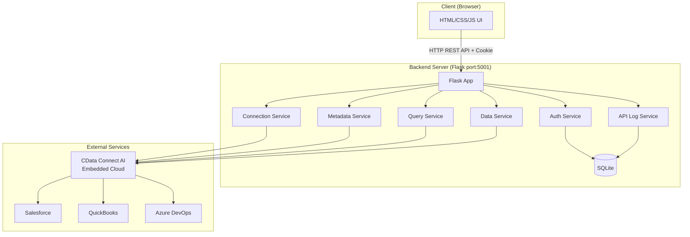
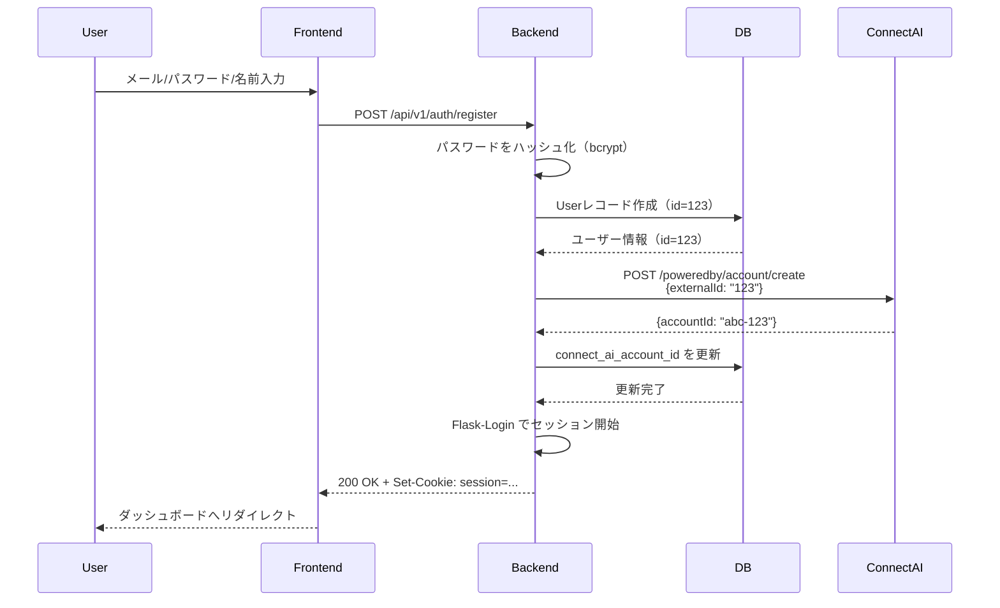
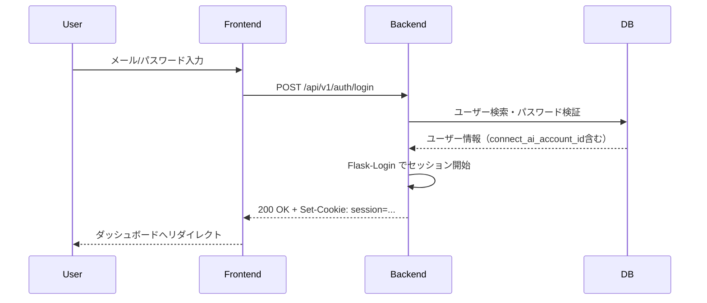
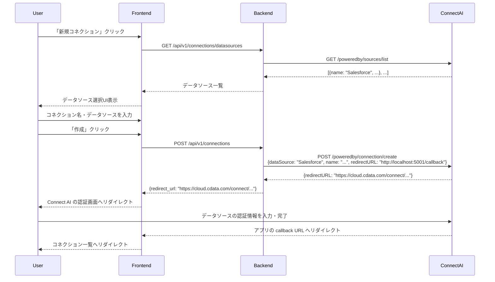
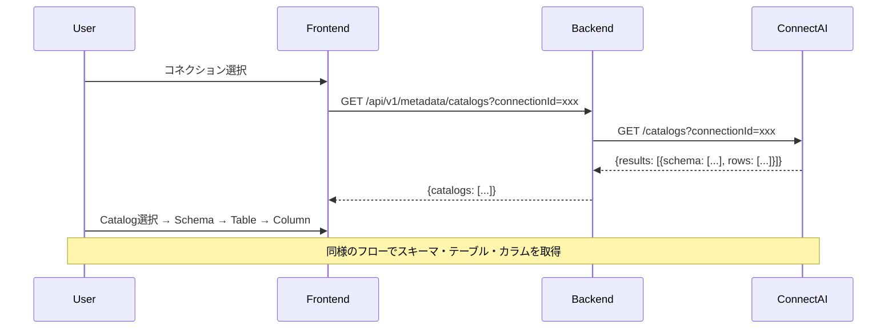
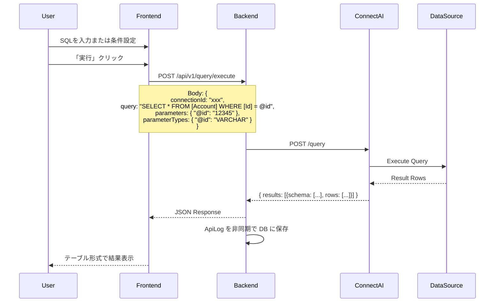
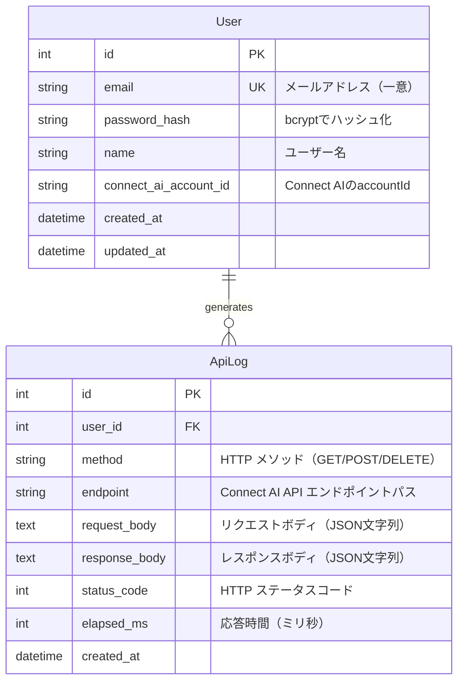
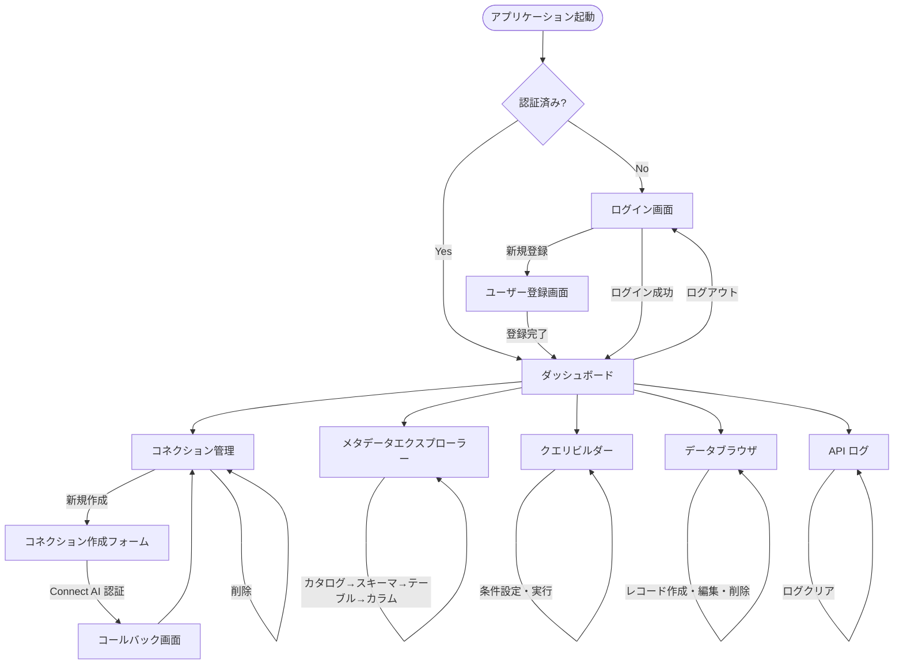

# 機能設計書: DataHub - Connect AI OEM リファレンス実装

**バージョン**: 1.1
**最終更新**: 2026-02-23
**対象フェーズ**: Phase 1-3 (MVP + クエリ・CRUD機能 + API ログ)

---

## 目次

1. [システムアーキテクチャ](#1-システムアーキテクチャ)
2. [システム構成図](#2-システム構成図)
3. [データモデル定義](#3-データモデル定義)
4. [コンポーネント設計](#4-コンポーネント設計)
5. [画面遷移図](#5-画面遷移図)
6. [API設計](#6-api設計)
7. [セキュリティ設計](#7-セキュリティ設計)

---

## 1. システムアーキテクチャ

### 1.1 アーキテクチャパターン

**3層アーキテクチャ + 外部API連携パターン**

```
┌─────────────────────────────────────────────────────────┐
│                    Presentation Layer                    │
│  (HTML/JavaScript - ブラウザで動作するSPA風UI)          │
└─────────────────────────────────────────────────────────┘
                            ↓ HTTP/REST API
┌─────────────────────────────────────────────────────────┐
│                    Application Layer                     │
│    (Flask - ビジネスロジック、認証、ルーティング)        │
└─────────────────────────────────────────────────────────┘
                            ↓
        ┌──────────────────┴──────────────────┐
        ↓                                     ↓
┌──────────────────┐              ┌─────────────────────┐
│   Data Layer     │              │  Integration Layer  │
│  (SQLAlchemy)    │              │  (HTTP API Client)  │
│  ・User          │              │  ・GET /catalogs    │
│  ・ApiLog        │              │  ・GET /schemas     │
└──────────────────┘              │  ・GET /tables      │
        ↓                         │  ・GET /columns     │
┌──────────────────┐              │  ・POST /query      │
│  SQLite          │              └─────────────────────┘
└──────────────────┘                        ↓
                                  ┌─────────────────────┐
                                  │  CData Connect AI   │
                                  │  Embedded Cloud     │
                                  └─────────────────────┘
                                           ↓
                           ┌───────────────┼───────────────┐
                           ↓               ↓               ↓
                     [Salesforce]   [QuickBooks]   [Azure DevOps]
```

### 1.2 技術スタック詳細

#### Backend
- **フレームワーク**: Flask 3.0.0
  - 選定理由: 軽量、学習コスト低、RESTful API構築に最適
- **ORM**: SQLAlchemy 2.x + Flask-SQLAlchemy
- **認証**: Flask-Login 0.6.3（Cookie ベースのセッション管理）
- **バリデーション**: Pydantic 2.x (データスキーマ検証)
- **暗号化**: cryptography (RSA秘密鍵でのJWT署名)
- **環境変数管理**: python-dotenv

#### Frontend
- **HTML5**: セマンティックマークアップ
- **CSSフレームワーク**: Tailwind CSS（CDN経由）
- **JavaScript**: Alpine.js 3.x（インラインのリアクティブ状態管理）
- **HTTPクライアント**: Fetch API（`api-client.js` でラップ）
- **共通ヘッダー**: `header.js`（各ページ共通のナビゲーションコンポーネント）

#### Database
- **開発環境**: SQLite 3.x
- **マイグレーション**: Alembic（Flask-Migrate 経由）

---

## 2. システム構成図

### 2.1 全体構成



### 2.2 認証フロー

#### ユーザー登録フロー



#### ログインフロー



### 2.3 コネクション作成フロー



### 2.4 メタデータ探索フロー



### 2.5 クエリ実行フロー



---

## 3. データモデル定義

### 3.1 ER図



> **注**: `Connection` モデルはアプリケーション側のDBには存在しません。コネクション情報は Connect AI 側で管理され、`GET /poweredby/connection/list` API で取得します。

### 3.2 テーブル定義詳細

#### 3.2.1 users テーブル

| カラム名 | 型 | NULL | デフォルト | 制約 | 説明 |
|---------|-----|------|----------|------|------|
| id | INTEGER | NO | AUTO_INCREMENT | PK | ユーザーID |
| email | VARCHAR(255) | NO | - | UNIQUE | メールアドレス |
| password_hash | VARCHAR(255) | NO | - | - | bcryptハッシュ |
| name | VARCHAR(100) | NO | - | - | ユーザー名 |
| connect_ai_account_id | VARCHAR(255) | YES | NULL | - | Connect AIのaccountId |
| created_at | TIMESTAMP | NO | CURRENT_TIMESTAMP | - | 作成日時 |
| updated_at | TIMESTAMP | NO | CURRENT_TIMESTAMP | ON UPDATE | 更新日時 |

#### 3.2.2 api_logs テーブル（Phase 3）

| カラム名 | 型 | NULL | デフォルト | 制約 | 説明 |
|---------|-----|------|----------|------|------|
| id | INTEGER | NO | AUTO_INCREMENT | PK | ログID |
| user_id | INTEGER | NO | - | FK → users.id | ユーザーID |
| method | VARCHAR(10) | NO | - | - | GET/POST/DELETE |
| endpoint | VARCHAR(500) | NO | - | - | Connect AI APIエンドポイント |
| request_body | TEXT | YES | NULL | - | リクエストボディ（JSON文字列） |
| response_body | TEXT | YES | NULL | - | レスポンスボディ（JSON文字列） |
| status_code | INTEGER | NO | - | - | HTTPステータスコード |
| elapsed_ms | INTEGER | NO | - | - | 応答時間（ミリ秒） |
| created_at | TIMESTAMP | NO | CURRENT_TIMESTAMP | - | 作成日時 |

**ログ記録方式**: メイン処理をブロックしないよう、`threading.Thread` でバックグラウンド書き込みを行います。

---

## 4. コンポーネント設計

### 4.1 Backend コンポーネント

#### 4.1.1 認証サービス (auth_service.py)

**責務**: ユーザー認証、Flask-Login セッション管理

- `register_user(email, password, name)` → User
  - メールアドレスの重複チェック
  - パスワードのハッシュ化（bcrypt）
  - Userレコード作成 → Connect AI Account API で子アカウント作成
  - Flask-Login `login_user()` でセッション開始
- `login_user_with_credentials(email, password)` → User
  - メールアドレスでユーザー検索・パスワードハッシュ検証
  - Flask-Login `login_user()` でセッション開始

#### 4.1.2 コネクションサービス (connection_service.py)

**責務**: Connect AI のコネクション管理

- `get_datasources(account_id)` → list[dict]
  - `GET /poweredby/sources/list` でデータソース一覧取得
- `get_connections(account_id)` → list[dict]
  - `GET /poweredby/connection/list` でコネクション一覧取得
- `create_connection(account_id, name, data_source, redirect_url)` → str
  - `POST /poweredby/connection/create` でコネクション作成
  - 返却された `redirectURL` を返す
- `delete_connection(account_id, connection_id)` → None
  - `DELETE /poweredby/connection/delete/{id}` でコネクション削除

#### 4.1.3 メタデータサービス (metadata_service.py)

**責務**: CData Connect AI からメタデータ取得

- `get_catalogs(account_id, connection_id)` → list[dict]
- `get_schemas(account_id, connection_id, catalog_name)` → list[dict]
- `get_tables(account_id, connection_id, catalog_name, schema_name)` → list[dict]
- `get_columns(account_id, connection_id, catalog_name, schema_name, table_name)` → list[dict]

#### 4.1.4 クエリサービス (query_service.py)

**責務**: SQLクエリの実行

- `execute_query(account_id, sql, params, param_types)` → tuple[list[str], list[list]]
  - `POST /query` でクエリ実行
  - `(column_names, rows)` を返す

#### 4.1.5 データサービス (data_service.py)

**責務**: データCRUD操作

- `get_records(account_id, connection_id, catalog, schema, table, limit, offset)` → tuple[list[str], list[list]]
  - SELECT文を構築して実行
- `insert_record(account_id, connection_id, catalog, schema, table, data)` → None
  - INSERT文を構築して実行
- `update_record(account_id, connection_id, catalog, schema, table, data, pk_column, pk_value)` → None
  - UPDATE文を構築して実行
- `delete_record(account_id, connection_id, catalog, schema, table, pk_column, pk_value)` → None
  - DELETE文を構築して実行

#### 4.1.6 API ログサービス (api_log_service.py)

**責務**: Connect AI API 呼び出しログの取得

- `get_logs(user_id, limit)` → list[ApiLog]
  - 最新のAPIログ一覧取得

#### 4.1.7 Connect AI HTTP APIクライアント (connectai/client.py)

**責務**: Connect AI API との HTTP 通信

各メソッド呼び出し時に JWT を生成してリクエストに付与します。また、すべての API 呼び出し結果を `ApiLog` に非同期で記録します（`threading.Thread` による fire-and-forget）。

### 4.2 Frontend コンポーネント

#### 4.2.1 APIクライアント (api-client.js)

```javascript
class APIClient {
    constructor(baseURL = '/api/v1') {
        this.baseURL = baseURL;
        // Cookie ベースの認証のため、JWT トークンは不要
    }

    async request(method, endpoint, data = null) {
        // Fetch API で HTTP リクエスト（credentials: 'include'）
        // エラーハンドリング
    }

    // 認証 API
    async login(email, password) { }
    async register(email, password, name) { }
    async logout() { }

    // コネクション API
    async getConnections() { }
    async getDatasources() { }
    async createConnection(data) { }
    async deleteConnection(connectionId) { }

    // メタデータ API
    async getCatalogs(connectionId) { }
    async getSchemas(connectionId, catalogName) { }
    async getTables(connectionId, catalogName, schemaName) { }
    async getColumns(connectionId, catalogName, schemaName, tableName) { }

    // クエリ API
    async executeQuery(connectionId, query, parameters, parameterTypes) { }

    // データ CRUD API
    async getRecords(connectionId, catalog, schema, table, limit, offset) { }
    async insertRecord(connectionId, catalog, schema, table, data) { }
    async updateRecord(connectionId, catalog, schema, table, data, pkColumn, pkValue) { }
    async deleteRecord(connectionId, catalog, schema, table, pkColumn, pkValue) { }

    // API ログ
    async getApiLogs(limit) { }
    async clearApiLogs() { }
}
```

#### 4.2.2 認証モジュール (auth.js)

```javascript
const apiClient = new APIClient();

async function logout() {
    try {
        await apiClient.logout();
        window.location.href = '/login';
    } catch (e) {
        console.error('ログアウトに失敗しました', e);
    }
}
```

#### 4.2.3 共通ヘッダーコンポーネント (header.js)

```javascript
// 全保護ページで読み込み（synchronous、Alpine.js より先）
window.renderAppHeader = function(currentPage) {
    // NAV_ITEMS から HTML を生成してページに挿入
    // currentPage に一致するナビアイテムをアクティブ表示（青色テキスト + ボーダー）
    // ロゴ「DataHub」はダッシュボードへのリンク
    // 「ログアウト」ボタンは onclick="logout()" （auth.js の関数）
};
```

**利用方法:**
```html
<!-- <head> 内で header.js を読み込み（Alpine.js の defer より前） -->
<script src="/static/js/header.js"></script>

<!-- <body> 冒頭で呼び出す -->
<div id="app-header"></div>
<script>renderAppHeader('connections');</script>
```

---

## 5. 画面遷移図

### 5.1 画面遷移フロー



### 5.2 主要画面一覧

| 画面名 | URL | 説明 | 認証 |
|-------|-----|------|------|
| ログイン | `/login` | メール/パスワード入力 | 不要 |
| ユーザー登録 | `/register` | メール/パスワード/名前入力 | 不要 |
| ダッシュボード | `/dashboard` | 各機能へのナビゲーション | 必要 |
| コネクション管理 | `/connections` | コネクション一覧、削除 | 必要 |
| コネクション作成 | `/connections/new` | データソース選択、コネクション名入力 | 必要 |
| コールバック | `/callback` | Connect AI 認証完了後のリダイレクト | 必要 |
| メタデータエクスプローラー | `/explorer` | カタログ→スキーマ→テーブル→カラムのドリルダウン | 必要 |
| クエリビルダー | `/query` | SQL入力・実行・結果表示 | 必要 |
| データブラウザ | `/data-browser` | レコード一覧、CRUD操作 | 必要 |
| API ログ | `/api-log` | Connect AI API 呼び出し履歴 | 必要 |

---

## 6. API設計

### 6.1 API エンドポイント一覧

#### 6.1.1 認証API

| メソッド | エンドポイント | 説明 | リクエスト | レスポンス |
|---------|--------------|------|----------|----------|
| POST | `/api/v1/auth/register` | ユーザー登録 | `{email, password, name}` | `{user}` |
| POST | `/api/v1/auth/login` | ログイン | `{email, password}` | `{user}` |
| POST | `/api/v1/auth/logout` | ログアウト | - | `{message}` |
| GET | `/api/v1/auth/me` | 現在のユーザー情報取得 | - | `{user}` |

> **注**: ログイン・ログアウトは Cookie セッションで管理します。JWT トークンのレスポンスは返しません。

#### 6.1.2 コネクションAPI

| メソッド | エンドポイント | 説明 | リクエスト | レスポンス |
|---------|--------------|------|----------|----------|
| GET | `/api/v1/connections` | コネクション一覧取得 | - | `{connections: [...]}` |
| GET | `/api/v1/connections/datasources` | データソース一覧取得 | - | `{dataSources: [...]}` |
| POST | `/api/v1/connections` | コネクション作成 | `{name, data_source}` | `{redirect_url}` |
| DELETE | `/api/v1/connections/:id` | コネクション削除 | - | `{message}` |

#### 6.1.3 メタデータAPI

| メソッド | エンドポイント | 説明 | クエリパラメータ | レスポンス |
|---------|--------------|------|---------------|----------|
| GET | `/api/v1/metadata/catalogs` | カタログ一覧 | `connectionId` | `{catalogs: [...]}` |
| GET | `/api/v1/metadata/schemas` | スキーマ一覧 | `connectionId, catalogName` | `{schemas: [...]}` |
| GET | `/api/v1/metadata/tables` | テーブル一覧 | `connectionId, catalogName, schemaName` | `{tables: [...]}` |
| GET | `/api/v1/metadata/columns` | カラム一覧 | `connectionId, catalogName, schemaName, tableName` | `{columns: [...]}` |

#### 6.1.4 クエリAPI

| メソッド | エンドポイント | 説明 | リクエスト | レスポンス |
|---------|--------------|------|----------|----------|
| POST | `/api/v1/query/execute` | クエリ実行 | `{connectionId, query, parameters?, parameterTypes?}` | `{columns, rows}` |

#### 6.1.5 データCRUD API

| メソッド | エンドポイント | 説明 | リクエスト | レスポンス |
|---------|--------------|------|----------|----------|
| GET | `/api/v1/data/records` | レコード一覧取得 | クエリパラメータ: `{connectionId, catalog, schema, table, limit?, offset?}` | `{columns, rows, total}` |
| POST | `/api/v1/data/records` | レコード作成 | `{connectionId, catalog, schema, table, data}` | `{message}` |
| PUT | `/api/v1/data/records` | レコード更新 | `{connectionId, catalog, schema, table, data, pk_column, pk_value}` | `{message}` |
| DELETE | `/api/v1/data/records` | レコード削除 | `{connectionId, catalog, schema, table, pk_column, pk_value}` | `{message}` |

#### 6.1.6 API ログ API（Phase 3）

| メソッド | エンドポイント | 説明 | リクエスト | レスポンス |
|---------|--------------|------|----------|----------|
| GET | `/api/v1/api-logs` | APIログ一覧取得 | クエリパラメータ: `limit?` | `{logs: [...]}` |
| DELETE | `/api/v1/api-logs` | APIログ全削除 | - | `{message}` |

### 6.2 クエリ実行 API 詳細

#### POST /api/v1/query/execute

**リクエスト:**
```json
{
  "connectionId": "SalesforceConnection1",
  "query": "SELECT [Id], [Name] FROM [Account] WHERE [Industry] = @industry",
  "parameters": {
    "@industry": "Technology"
  },
  "parameterTypes": {
    "@industry": "VARCHAR"
  }
}
```

**レスポンス (成功 - 200 OK):**
```json
{
  "columns": ["Id", "Name"],
  "rows": [
    ["001...", "Acme Corp"],
    ["002...", "TechStart Inc"]
  ]
}
```

---

## 7. セキュリティ設計（デモ用・簡略版）

**注**: 本アプリケーションはデモ用途でローカル環境での動作を想定しているため、セキュリティ要件は最小限に絞っています。

### 7.1 認証・認可

#### 7.1.1 パスワード管理
- **ハッシュ化**: bcrypt (cost factor: 10)
- **保存形式**: `$2b$10$...` (60文字)
- **パスワードポリシー**: 最小8文字

#### 7.1.2 セッション管理（Flask-Login）
- **方式**: Cookie ベースのサーバーサイドセッション
- **Cookie 署名**: `SECRET_KEY` による HMAC 署名
- **保護**: `@login_required` デコレータで全 API エンドポイントを保護
- **localStorage への JWT 保存は行いません**

#### 7.1.3 Connect AI 認証
- **JWT生成**: RSA 256で署名（RS256）
- **鍵管理**: ファイルシステムで秘密鍵を管理（`backend/keys/private.key`）
- **Payload**:
  ```json
  {
    "tokenType": "powered-by",
    "iat": 1709208800,
    "exp": 1709212800,
    "iss": "parent_account_id",
    "sub": "child_account_id"
  }
  ```

### 7.2 データ保護

#### 7.2.1 テナント分離
- **実装方法**: Flask-Login の `current_user` を通じて `connect_ai_account_id` を取得
- Connect AI API への全リクエストはこの `account_id` に基づいてテナント分離

### 7.3 SQLインジェクション対策

#### 7.3.1 パラメータ化クエリの強制
- **Connect AI API**: すべてのクエリで `parameters` オプションを使用
- **識別子のエスケープ**: テーブル名、カラム名を `[]` でクォート
- **検証**: ユーザー入力を直接SQL文に埋め込まない

**良い例:**
```python
query = "SELECT * FROM [Customers] WHERE [Id] = @id"
parameters = {"@id": user_input}
parameterTypes = {"@id": "VARCHAR"}
```

**悪い例 (SQLインジェクション脆弱性):**
```python
query = f"SELECT * FROM Customers WHERE Id = '{user_input}'"  # ❌ 絶対に避ける
```

### 7.4 API ログ記録（Phase 3）

Connect AI API への全リクエスト・レスポンスを `api_logs` テーブルに記録します。

- **記録内容**: メソッド、エンドポイント、リクエストボディ、レスポンスボディ、ステータスコード、応答時間
- **センシティブ情報**: JWT トークン・パスワードはログに含まれません
- **記録方式**: `threading.Thread` による非同期書き込み（メイン処理をブロックしない）
- **閲覧**: `/api-log` 画面から最新ログを確認・削除できます

---

**承認者**: _________________
**承認日**: _________________
